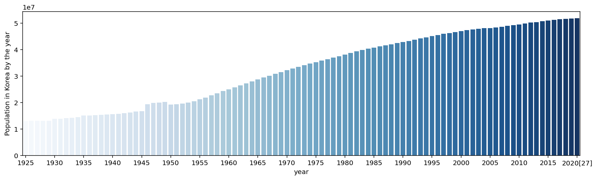
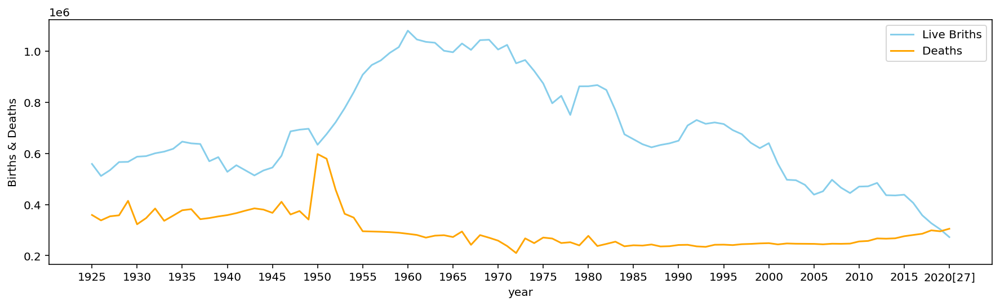

Let's look at the population in Korea.   
South Korea's population reached more than **50 million** in 2016
and it's about 51 million this year, 2021.   
But **living alone and childless** is becoming a way of life for a younger generation in Korea these days.
South Korea reports population drop, with **more deaths than births for the first time last year**. 
Like other developed countries, 
Korea is well known for being a fast-aging country in the world. 
I will show you several graphs to show Korea's demographic situation

[Population in Korea by the year]
<details>
<summary>Folding</summary>
<div markdown="1">

```python
import pandas as pd
import matplotlib.pyplot as plt
import seaborn as sns
from IPython.display import set_matplotlib_formats
url = "https://en.wikipedia.org/wiki/Demographics_of_South_Korea"
df = pd.read_html(url)
df = df[8]
df.rename(columns = {"Unnamed: 0": "year"}, inplace = True)
set_matplotlib_formats("retina")
plt.figure(figsize=(15,4))
plt.xticks(rotation=60)
p = sns.barplot(data=df, x="year",y="Average population",palette="Blues")
p.set_ylabel("Population in Korea by the year")
```

</div>
</details>
    Text(0, 0.5, 'Population in Korea by the year')
    

    


[Live Births & Deaths in Korea]
details>
<summary>Folding</summary>
<div markdown="1">

```python
plt.figure(figsize=(15,4))
plt.xticks(rotation=60)
p = sns.lineplot(data = df,x="year",y="Live births", color="skyblue")
p = sns.lineplot(data = df,x="year",y="Deaths", color="orange")
p.set_ylabel("Births & Deaths")
```


</div>
</details>


    Text(0, 0.5, 'Births & Deaths')


    

