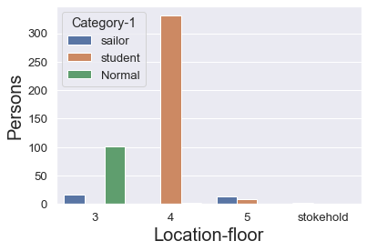

16 April 2014, I had exercised in the gym inside the office center at lunchtime. 
I was running on the treadmill, watching the news.
Bottom side of the screen, there are red letters of "**breaking news**" and It had reported about the current status of the ferry named 'Sewol'.    
**It was sinking!!**

After 30 minutes, I could get a good news from TV.  
I remember exactly that the announcer had said "all passengers are saved" and I relieved at that time.   

But it was huge misinformation.    
Out of **476 passengers and crew, 304 died in the disaster**,    
including around **250 students from Danwon High School** Of the approximately 172 survivors.   

The ferry has sunk to the bottom of the ocean because it lost the center of gravity with a quick turn.
(Renovations by the owner, and approved by regulators, made the ferry more profitable, but also dangerous)    

Let's look at the infographics from newspaper. 


I got a total of 476 passenger lists. 

|Main Category|Median|Mistress|floor|location|survival|gender|age|
|---|---|---|---|---|---|---|---|
|sailor|Deck|Shift captain|5|front|survival|male|69|
|sailor|Deck|1|5|front|survival|male|42.0|
|sailor|Deck|1st,|5|front|survival|male|34.0|
|sailor|Deck|2nd sailor|5|front|survival|male|47.0|
|sailor|Deck|3,|5|front|survival|female|26.0|


The graph below shows how the passengers & crews are composed of.   

[composition of age in Sewol passengers]
<details>
<summary>Folding Python Code (click!)</summary>
<div markdown="1">

```python
import numpy as np # linear algebra
import pandas as pd # data processing, CSV file I/O (e.g. pd.read_csv)
import seaborn as sns
import matplotlib.pyplot as plt
import matplotlib as mpl
import googletrans
from googletrans import Translator
Sewol_kr = pd.read_csv('./sewol.csv',encoding='utf-8')
translator = Translator()
# make a deep copy of the data frame
Sewol = Sewol_kr.copy()
# translate columns' name using rename function
Sewol.rename(columns=lambda x: translator.translate(x).text, inplace=True)
Sewol['gender'] = np.where(pd.notnull(Sewol['gender']),Sewol['gender'],Sewol['Gender estimation'])
Sewol = Sewol.drop(['Gender estimation'],axis=1)
Sewol = Sewol.iloc[:,:7]
translations = {}
for column in Sewol.columns:
    # unique elements of the column
    unique_elements = Sewol[column].unique()
    for element in unique_elements:
        # add translation to the dictionary
        translations[element] = translator.translate(element).text
Sewol.replace(translations, inplace = True)
Sewol['age'] = Sewol_kr['나이']
Sewol.rename(columns = {'Lifewater' : 'survival'}, inplace = True)
Sewol['Main Category'] = Sewol['Main Category'].replace('Funnel','student')
sns.kdeplot(Sewol['age'])

```

</div>
</details>



