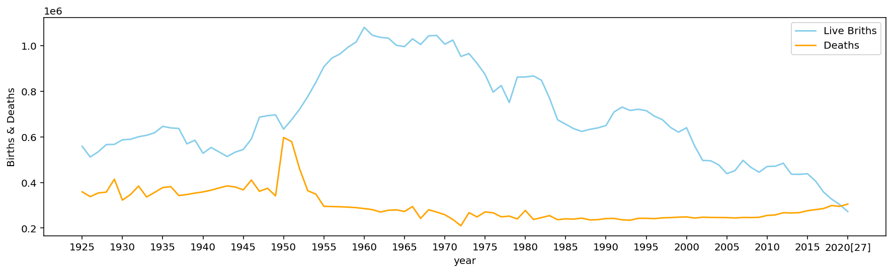

16 April 2014, I had exercised in the gym inside the office center at lunchtime. 
I was running on the treadmill, watching the news.
Bottom side of the screen, there are red letters of "breaking news" and It had reported about the current status of the Sewol sinking.   
After 30 minutes, the announcer had said "all passengers are saved".   

But it was misinformation.    
Out of 476 passengers and crew, 304 died in the disaster, including around 250 students from Danwon High School Of the approximately 172 survivors.   

Let's look at the picture of the ship

