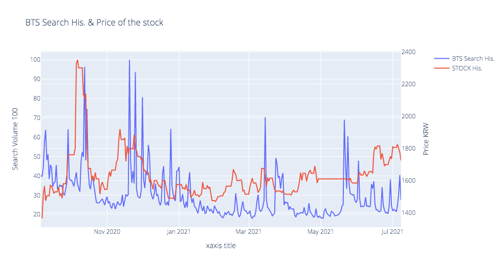
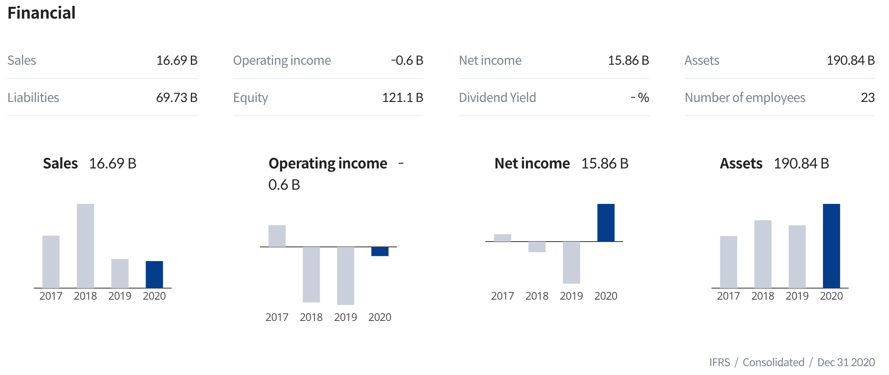

One day the voice of my darling plugged in my ear.   
"A BTS drama series based on the “BTS Universe” is coming soon"   
"My cousin said Chorokbaem stock could be beneficiary with BTS's debut on screen"   
My lover's cousin has gained fortune from the stock market.    

It could be the last call.    
I whispered to myself.     
"Let me buy those stocks"   

My heart beats faster, I tried to feel relaxed for considering the rate of return on this investment.   
I feel like being on the path of investors like Warren Buffet.    

"Chorokbaem (stock code: 052300)"
The company has diverse business areas related to filming movies and drama. 

My hand opened the mobile application quickly, having to search.   
This company is not a big major company and may have a weak financial position so 
the short-term strategy is right on this investement. 

One idea popped into my head.    
If I check the fluctuation of BTS keyword search, I could gain the current status of public interest on the global idol group. 

The graph below shows BTS search volume history and Chorokbaem's price history in the same place.    

['BTS' search volume and Chorokbaem's price history]
<details>
<summary>Folding Python Code (click!)</summary>
<div markdown="1">

```python
import numpy as np # python's Excel
import pandas as pd # data processing, CSV file I/O (e.g. pd.read_csv)
from bs4 import BeautifulSoup # Web parsing Tool
import urllib # Web Scraping Tool
from urllib import request
import json # Json is Json
import datetime # related to date
import plotly.graph_objects as go
from plotly.subplots import make_subplots

# Naver Search Setup
client_id = "*********" # registered client ID from NAVER
client_secret = "********" 

link = "https://openapi.naver.com/v1/datalab/search"
requested = request.Request(link)
requested.add_header("X-Naver-Client-Id",client_id)
requested.add_header("X-Naver-Client-Secret",client_secret)
requested.add_header("Content-Type","application/json")

today = str(datetime.datetime.now().date()-datetime.timedelta(days=60)) # Today 
startdate = str(datetime.datetime.now().date() - datetime.timedelta(days=1*365)) # 1 year ago 

BTS_body = "{\"startDate\":\""+startdate+"\",\"endDate\":\""+today+"\",\"timeUnit\":\"date\",\"keywordGroups\":[{\"groupName\":\"BTS\",\"keywords\":[\"BTS\",\"비티에스\",\"유스\",\"YOUTH\",\"방탄소년단\"]}]}";
chorok_body = "{\"startDate\":\""+startdate+"\",\"endDate\":\""+today+"\",\"timeUnit\":\"date\",\"keywordGroups\":[{\"groupName\":\"초록뱀\",\"keywords\":[\"초록뱀\",\"초록뱀 미디어\",\"초록뱀 컴퍼니\",\"W홀딩컴퍼니\"]}]}";

BTS_response = urllib.request.urlopen(requested, data=BTS_body.encode("utf-8"))
BTS_rescode = BTS_response.getcode()
chorok_response = urllib.request.urlopen(requested, data=chorok_body.encode("utf-8"))
chorok_rescode = chorok_response.getcode()

if(BTS_rescode==200):
    response_body = BTS_response.read()
    output_data = response_body.decode('utf-8')
else:
    print('Error code:'+ rescode)

BTS_result = json.loads(output_data)
    
if(chorok_rescode==200):
    response_body = chorok_response.read()
    output_data = response_body.decode('utf-8')
else:
    print('Error code:'+ rescode)

chorok_result = json.loads(output_data)

date = [a['period'] for a in BTS_result['results'][0]['data']]
chorok_ratio = [a['ratio'] for a in chorok_result['results'][0]['data']]
BTS_ratio = [a['ratio'] for a in BTS_result['results'][0]['data']]

SearchResult_df = pd.DataFrame({'date':date, 
              '초록뱀':chorok_ratio,
              'BTS':BTS_ratio})

SearchResult_df['date'] = pd.to_datetime(SearchResult_df['date'], format='%Y-%m-%d', errors='raise')
colors = ['#BB0000', '#0000BB']

import FinanceDataReader as fdr
df2 = fdr.DataReader('052300',startdate,today)
df2 = df2[['Close','Volume']]
df2 = df2.reset_index()

df2['Date'] = pd.to_datetime(df2['Date'], format='%Y-%m-%d', errors='raise')

df = pd.merge(SearchResult_df,df2,left_on='date',right_on='Date',how='outer')

df = df.loc[:, ['date','초록뱀','BTS','Close','Volume']]
df = df.fillna(method='ffill')
df['Volume']=df['Volume']/df['Volume'].max()*100

# Create figure with secondary y-axis
fig = make_subplots(specs=[[{"secondary_y": True}]])

# Add traces
fig.add_trace(
    go.Scatter(x=df['date'], y=df['BTS'], name="BTS Search His."),
    secondary_y=False
)


fig.add_trace(
    go.Scatter(x=df['date'], y=df['Close'], name="STOCK His."),
    secondary_y=True
)

#fig.add_trace(
#    go.Scatter(x=df['date'], y=df['Volume'], name="STOCK Volume His."),
#    secondary_y=False
#)


# Add figure title
fig.update_layout(
    title_text="Double Y Axis Example"
)

# Set x-axis title
fig.update_xaxes(title_text="xaxis title")

# Set y-axes titles
fig.update_yaxes(title_text="<b>Search Volume</b> 100", secondary_y=False)
fig.update_yaxes(title_text="<b>Price</b> KRW", secondary_y=True)

fig.show()

```

</div>
</details>
    



How's it? Both of them seemed to be aligned.   
And fortunately, search volume could be a leading indicator for the stock's down trend.   

Let's see the company's financial status.   



Revenue has been plunging 2years ago rather than increasing continually, **low growth**.   
However, net income seems good last year.   

I decided to invest small money due to long-term risk. 

I will update this blog when I got a point to sell 
(High volme on BTS search, leading indicator of down trend of the stock)