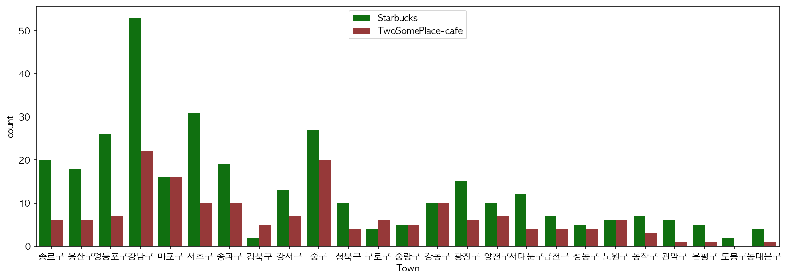
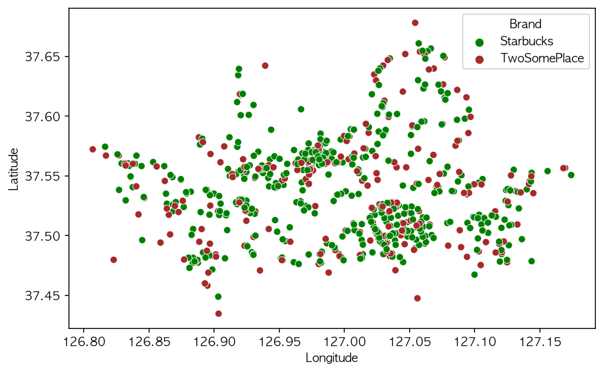

South Korea has more than **1,200 Starbucks** locations, more than the United Kingdom,
making the country one of the coffee giant's largest markets. 

Foreigners can visit Starbucks shortly after arriving in South Korea.    
Anybody can discover the stores have a lot in common with them in the US.   

I also like the place with a fancy sign "STARBUCKS".     
In Korea, "STARBUCKS" means **something more than a cup of coffee**.   
Comparing to the price of a meal, It seems to cost a lot to a person who doesn't want to pay for culture or brand.     
When STARBUCKS launched in Korea, 
Someone who grabs a cup of Starbucks coffee looks **a stylish trend citizen**.   

Until now, Starbucks is known for being one of the best places to sip a cup of coffee.  

But its locations are too many especially in Seoul even though I am writing this post in Starbucks located in Gangnam, Seoul.    

[locations of 2 big coffee franchises by town]
<details>
<summary>Folding Python Code (click!)</summary>
<div markdown="1">

```python
import pandas as pd
import numpy as np
import seaborn as sns
import googletrans
from googletrans import Translator
import matplotlib.pyplot as plt
from IPython.display import set_matplotlib_formats

translator = Translator()

plt.rc("font", family="AppleGothic")
plt.rc("axes", unicode_minus=False)

set_matplotlib_formats("retina")

df = pd.read_csv("../../info_20.csv")
df.rename(columns=lambda x: translator.translate(x).text, inplace=True)

columns = ['Mutual name', 'Country-in-class classification name', 'Classification name', 'Summary', 
           'Attempt', 'Life', 'Administrative name', 'Legal name', 'Street name address', 
           'Hardness', 'Latitude']
df = df[columns].copy()
df = df.rename(columns = {'Mutual name' : 'Store name', 'Summary' : 'Classification name-2', 'Attempt':'City', 'Life': 'Town','Hardness':'Longitude'})

fig = plt.figure(figsize=(15,5))
df_seoul = df.copy()
df_cafe = df_seoul[df_seoul["Store name"].notnull()&df_seoul['Store name'].str.contains('스타벅스|투썸플레이스')]
df_cafe.loc[df_cafe["Store name"].str.contains('스타벅스'), "Brand"] = "Starbucks"
df_cafe.loc[df_cafe["Store name"].str.contains('투썸플레이스'), "Brand"] = "TwoSomePlace"
sns.countplot(data=df_cafe, x="Town", hue="Brand")
colors = ["green", "brown"]
sns.set_palette(sns.color_palette(colors))

```
</div>
</details>

    
**In Gangnam, there are nearly 80 Starbucks locations.**
And every locations have full of customers after lunch time. 

A lot of new coffee shops open and close around Starbucks. 
But winner has always been Starbucks. 

Let's see shape of the coffee location distribution.  

[shape of the distribution]
<details>
<summary>Folding Python Code (click!)</summary>
<div markdown="1">

```python
fig = plt.figure(figsize=(8,5))
colors = ["green", "brown"]
sns.set_palette(sns.color_palette(colors))
sns.scatterplot(data=df_cafe, x="Longitude", y="Latitude", hue="Brand")
```
</div>
</details>


    
It looks like map of Seoul!!!

I will show you the map of Seoul and their locations. 

<details>
<summary>Folding Python Code (click!)</summary>
<div markdown="1">

```python
import folium
lat = df_cafe["Latitude"].mean()
long = df_cafe["Longitude"].mean()
lat, long
m = folium.Map([lat, long], zoom_start=12, tiles="Stamen Toner")

for i in df_cafe.index:
    sub_lat = df_cafe.loc[i, "Latitude"]
    sub_long = df_cafe.loc[i, "Longitude"]
    
    title = f"{df_cafe.loc[i, 'Store name']} - {df_cafe.loc[i, 'Street name address']}"
    
    color = "green"
    if df_cafe.loc[i, "Store name"] == "투썸플레이스":
        color = "brown"
    
    folium.CircleMarker([sub_lat, sub_long],
                        radius=3,
                        color=color,
                          tooltip=title).add_to(m)
m
```
</div>
</details>

<iframe src="../assets/img/Coffee_franchise_map.html" height="200" width="100%"></iframe>